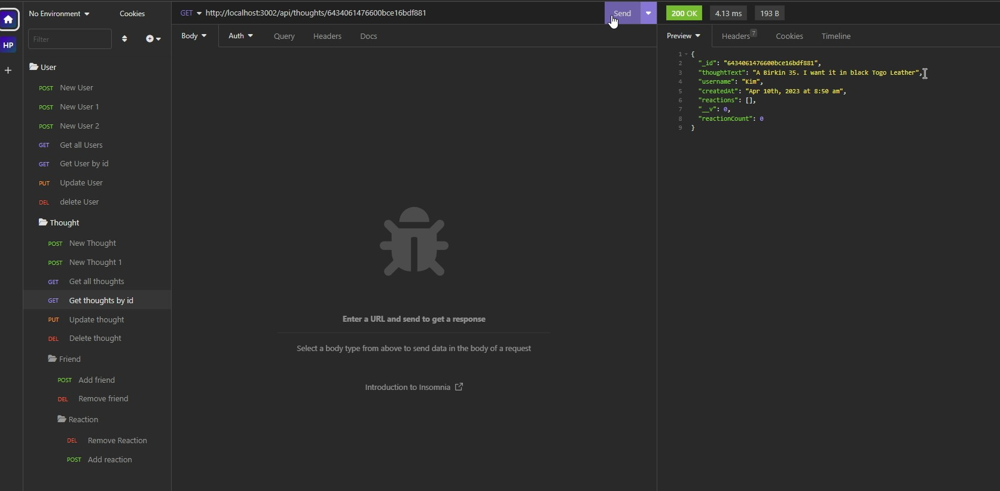
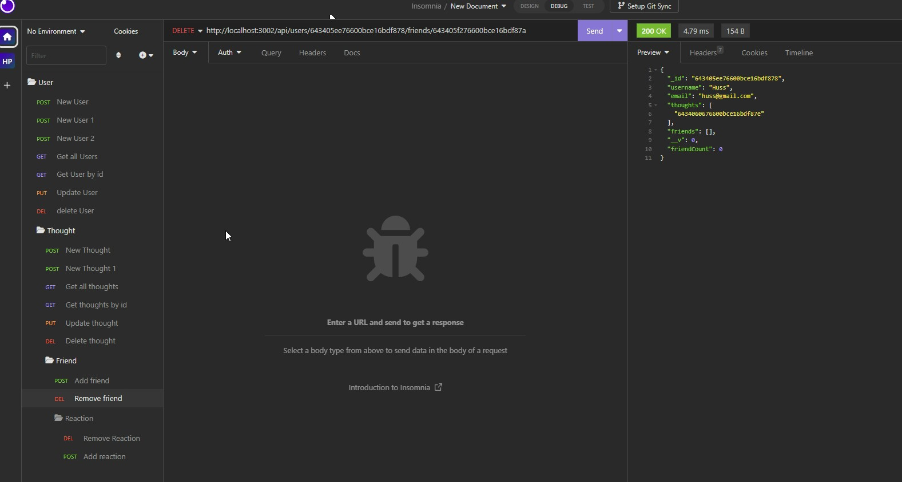

# Huss-Social-Network-API

 ## Table of Contents: 
* [Description](#Description)
* [Actions Taken](#Actions)
* [Screen Shot](#Screen)
* [Links](#Links)

## Description
For this week we built asocial network API. Using Express.js for routing, a MongoDB database, and the Mongoose ODM, this application constructs an API for a social network web application that utilizes a NoSQL database to effectively manage extensive volumes of unstructured data on the website.

## Actions Taken 
Executed the following commands to install the necessary packages and testing:

* To create a package.json file and add dependencies with their respective versions, run 'npm init' and follow the prompts.
* To install the express.js package for routing, run 'npm i express'.
* Mongoose is a MongoDB object modeling tool intended to operate in an asynchronous environment. It manages the link between the API and the MongoDB database. Mongoose supports both promises and callbacks. To install Mongoose, run 'npm i mongoose'.
*Start the MongoDB server by running 'mongod' from GitBash.
* To commence application execution, run 'npm start' or 'node server.js'.
* Used Insomnia to test 

## Screen Shot
Add user:

 

New thought:

 

Add friend:

 

Add reaction:

 

Delete thought:

 

Get all thoughts:

 

Get all users:

 

Get by user id:

 

Get thought by id:

 

Remove friend:

 

Remove reaction:

 

Update user:

## Links

Video Link: https://drive.google.com/file/d/1gY357mI7IaX9Ecw_3jorvdnBTqnlt5nQ/view

Github Link: https://github.com/hussrizk56/Huss-Social-Network-API
